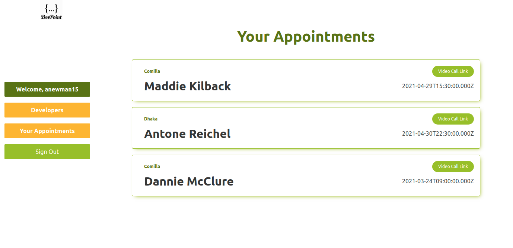

# DevPoint - Set an Appointment with a Developer
A site that allows hiring managers find and set up appointments with niche developers. Built with Rails/React/Redux.

## Built With
1. [JavaScript / ES6](https://developer.mozilla.org/en-US/docs/Web/JavaScript)
2. [React.js](https://reactjs.org/docs/getting-started.html)
3. [Redux.js](https://redux.js.org/)
4. [DevPoint API](https://anewman15-dev-point.netlify.app/) (not public)
5. [Jest](https://jestjs.io/docs/api)
6. [Enzyme](https://enzymejs.github.io/enzyme/)
7. HTML5
8. CSS3

## App Screenshot

## Live Demo
Available [here](https://anewman15-dev-point.netlify.app/)

## Deployment
1. Open your Terminal from a folder of your choice and clone [this repo](https://github.com/anewman15/dev-point-react/)
2. Navigate to the project directory
3. Run `yarn install`
4. Then run `yarn start`
5. Navigate to `localhost:3000`
6. Sign up, log in and use the website to view developers list, their profiles
7. Set appointments from the `/book_appointments` route
8. View the list of your appointments from `/appointments` route

## Testing
1. Run `yarn test` in the Terminal to run the tests

## Author

👤 **Abdullah Numan**

- Github:   https://github.com/anewman15
- Twitter:  https://twitter.com/aanuman15
- Linkedin: https://www.linkedin.com/in/aanuman15/
- Email:    anewman15@hotmail.com
## Contributing

Contributions, issues and feature requests are welcome!
Please send your feedback [here](https://github.com/anewman15/dev-point-react/issues)

## Design Credits
:thumbsup: :clap: to [Murat Korkmaz](https://www.behance.net/muratk) for [his design](https://www.behance.net/gallery/26425031/Vespa-Responsive-Redesign)
## Acknowledgments
- [Microverse, Inc.](https://www.microverse.org/)
- [The Odin Project](https://www.theodinproject.com/)
